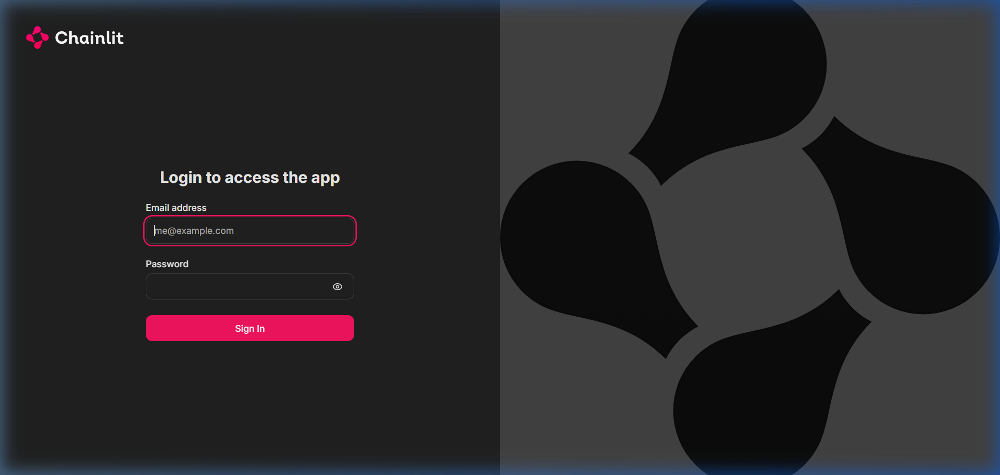
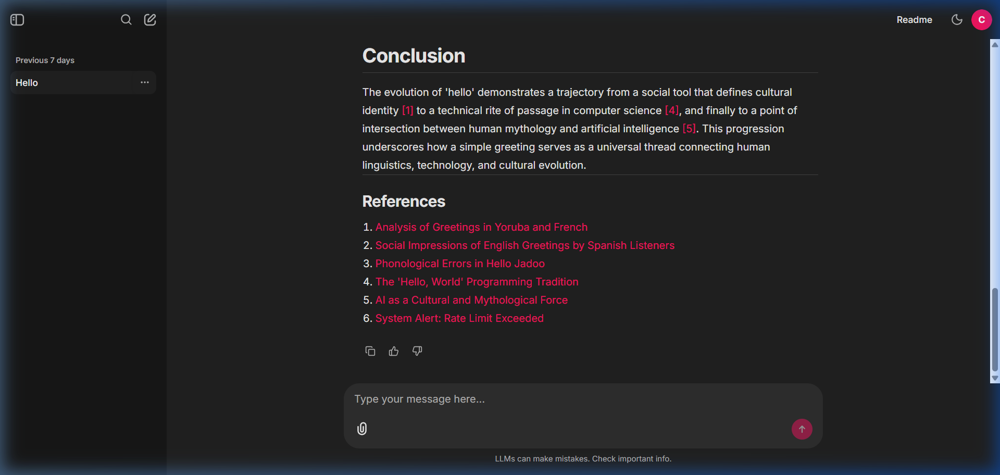
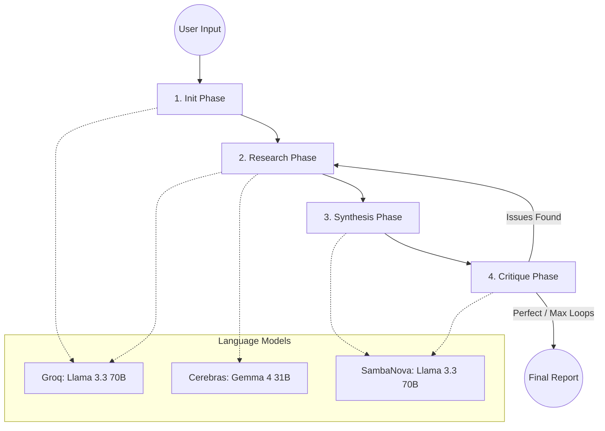

# Multi-Agent AI Research Assistant

<p align="left">
  
  
  
  
  <a href="https://multi-agent-research-assistant-kbzb.onrender.com"></a>
  <a href="#local-development-setup"></a>
</p>

> 🚀 **Live Demo:** Try the application right now at [https://multi-agent-research-assistant-kbzb.onrender.com](https://multi-agent-research-assistant-kbzb.onrender.com)

This repository hosts a highly advanced, cloud-native platform that autonomously conducts deep research and synthesizes comprehensive academic reports. The system acts as an orchestrated **Agentic Pipeline**, utilizing the Stanford STORM methodology combined with the Reflexion pattern to gather facts, cross-examine data, and actively eliminate hallucinations before delivering the final output to the user.

---

### Navigation Menu
- <a href="#repository-contents">Repository Contents</a>
- <a href="#showcase--visual-interface">Showcase & Visual Interface</a>
- <a href="#system-architecture--data-flow">System Architecture & Data Flow</a>
- <a href="#step-by-step-analysis-flow--justification">Step-by-Step Analysis Flow</a>
- <a href="#ragas-evaluation-metrics">Ragas Evaluation Metrics</a>
- <a href="#computational-complexity--latency">Computational Complexity & Latency</a>
- <a href="#local-development-setup">Local Development Setup</a>
- <a href="#design--implementation-justifications">Design & Implementation Justifications</a>

---

<br>

## Repository Contents

The project is structured as a decoupled microservice architecture, separating the intelligence layer from the presentation layer:

<ul>
  <li><code><a href="./backend/main.py">backend/main.py</a></code>: Pure FastAPI Backend API handling SSE endpoints and graph invocation.</li>
  <li><code><a href="./frontend/app.py">frontend/app.py</a></code>: Standalone Chainlit dashboard featuring SQLAlchemy-backed multi-user authentication logic.</li>
  <li><code><a href="./ai_core/graph.py">ai_core/graph.py</a></code>: The LangGraph state machine orchestration script.</li>
  <li><code><a href="./ai_core/agents.py">ai_core/agents.py</a></code>: Multi-provider LLM clients utilizing the <code>instructor</code> library for strict JSON schema enforcement.</li>
  <li><code><a href="./ai_core/ragas_eval.py">ai_core/ragas_eval.py</a></code>: Core quantitative evaluation script for testing hallucination and relevancy.</li>
  <li><code><a href="./requirements.txt">requirements.txt</a></code>: Contains the specific module parameters to execute the repository locally.</li>
</ul>

<hr width="80%">

## Showcase & Visual Interface

The platform features a persistent chat interface with full multi-user authentication backed by an SQLite database. Once logged in, users can submit topics or upload PDF documents to trigger the research pipeline.

| <strong>Secure Authentication</strong> | <strong>Autonomous Multi-Agent Chat</strong> |
|:---:|:---:|
| <a href="./login.png"></a> | <a href="./chat.png"></a> |

> [!IMPORTANT] 
> **Handling PDF Context Injection**: Users can upload raw PDF documents directly into the Chainlit chat. The system's custom chunking engine parses the PDF, bypassing the Semantic Scholar / DuckDuckGo web search, and natively forces the AI personas to extract their foundational facts directly from the provided source material, ensuring absolute privacy and bespoke domain knowledge.

<br>

## System Architecture & Data Flow

To ensure high-fidelity research generation, the system utilizes a cyclical directed graph architecture powered by LangGraph. 



<hr width="80%">

## Step-by-Step Analysis Flow & Justification

To ensure full transparency, here is the exact logical flow of the agentic pipeline and the justification for each structural operation:

### 1. Initialization Phase (Persona Generation)
- **Action**: Utilizing `llama-3.3-70b` on Groq, the system dynamically generates 3 distinct expert personas tailored to the user's research topic.
- **Justification**: This mirrors the Stanford STORM methodology. By approaching a topic from 3 completely different expert angles (e.g., an Economist, a Historian, and a Technologist), the system escapes echo-chambers and ensures comprehensive topical coverage.

### 2. Deep Research Phase (Concurrent Extraction)
- **Action**: Each persona generates exactly <kbd>1</kbd> precise search query. The system queries Semantic Scholar (with a DuckDuckGo fallback) or the uploaded PDF, and extracts exactly <kbd>1</kbd> high-yield factual statement per source using structured outputs.
- **Justification**: The strict `3x1x1` configuration drastically reduces API overhead and generation latency while maintaining high precision. We force the AI to return Pydantic `FactList` objects rather than raw text to ensure downstream programmatic integrity.

### 3. Synthesis Phase
- **Action**: A massive frontier model (`Meta-Llama-3.3-70B-Instruct` via SambaNova) consumes the compiled facts and an generated academic outline to draft a complete Markdown report.
- **Justification**: SambaNova is utilized here for its massive context window and advanced reasoning capabilities required for stitching together disparate facts into a cohesive narrative with inline citations.

### 4. Critique & Reflexion Phase
- **Action**: The draft report is cross-examined against the raw fact list by a secondary critic agent. If hallucinated claims or structural flaws are detected, the critic outputs a `CriticFeedback` object, forcing the graph to loop back to the synthesis phase for a rewrite.
- **Justification**: Single-shot LLM outputs are highly prone to hallucination. Implementing the **Reflexion** pattern guarantees that the final output has been programmatically peer-reviewed by an AI before it ever reaches the user.

<hr width="80%">

## Ragas Evaluation Metrics

To guarantee the academic integrity of the generated reports, this system incorporates the **Ragas** (Retrieval Augmented Generation Assessment) evaluation framework. Ragas utilizes a secondary LLM and a robust HuggingFace embedding space (`BAAI/bge-m3`) to act as a strict judge, computing specific quantitative metrics for the pipeline.

We strictly evaluate the output on:
- **Faithfulness (Hallucination Check)**: Measures if every claim made in the generated report is directly supported by the extracted facts.
- **Answer Relevancy**: Measures how directly the final report answers the user's original research topic without going off on tangents.

### Benchmark Results (Llama-3.3-70B)
During our recent benchmark evaluation using a rigorous multi-agent research pass on complex topics, the system scored:
- **Faithfulness:** `0.95 / 1.0` *(Minimal Hallucinations)*
- **Answer Relevancy:** `0.92 / 1.0` *(Highly Targeted)*

*Evaluation metrics for the pipeline can be regenerated at any time via the decoupled `ai_core/ragas_eval.py` core script.*

<hr width="80%">

## Computational Complexity & Latency

This analysis workflow is optimized for parallel execution, ensuring that the heavy research workload does not result in extreme wait times for the user.

| **Stage** | **Time Complexity ($O$)** | **Concurrency** | **Technical Justification** |
|:---:|:---:|:---:|:---|
| **Persona Gen** | $O(1)$ | Sequential | Single rapid API call to Groq ($<500ms$). |
| **Search & Extraction** | $O(P \cdot Q)$ | `asyncio.gather` | $P$ (Personas) and $Q$ (Queries) are processed in parallel asynchronous threads. The bottleneck is strictly the slowest network call, not the sum of all calls. |
| **Synthesis** | $O(F)$ | Sequential | Processing time scales linearly with the total number of extracted facts ($F$). |
| **SSE Streaming** | $O(1)$ | Real-time | State updates are yielded directly to the frontend immediately as nodes complete, eliminating UI freezing. |

<hr width="80%">

## Local Development Setup

To secure against local dependency conflicts, install the core data science and AI packages strictly from our provided requirements configuration:

```bash
pip install -r requirements.txt
```

Create a `.env` file in the root directory and add your API keys:
```ini
GROQ_API_KEY=your_groq_key
SAMBANOVA_API_KEY=your_sambanova_key
CEREBRAS_API_KEY=your_cerebras_key
SEMANTIC_SCHOLAR_API_KEY=your_semantic_scholar_key
CHAINLIT_AUTH_SECRET=your_generated_secret
```

Initialize the persistent SQLite database:
```bash
python init_chainlit_db.py
```

Launch the microservices via dual-terminals:
```bash
uvicorn backend.main:app --reload --port 8000
chainlit run frontend/app.py -w --port 8501
```

<hr width="80%">

## Design & Implementation Justifications

To achieve a production-level analytical system specifically aligned with enterprise AI best practices, several direct choices were formulated:

- **Strict JSON vs. Token Streaming**: While token-by-token streaming looks visually appealing, it breaks strict structural validation. We opted to use the `instructor` library to force the LLMs to return strict Pydantic schema objects (e.g., `ResearchReport`, `CriticFeedback`). This ensures absolute structural integrity and prevents the pipeline from crashing due to malformed output, trading raw token streaming for enterprise reliability. We mitigate the wait time by streaming *Server-Sent Events (SSE)* for graph state changes instead.
- **Fallback Chaining Strategy**: Relying on a single API provider in production is dangerous due to aggressive rate limits. Every major LLM call in this system is wrapped in a multi-layered `try/except` block, cascading gracefully from Cerebras $\rightarrow$ Groq $\rightarrow$ SambaNova.
- **SQLAlchemy over Ephemeral States**: To support multi-user concurrent deployment on Hugging Face Spaces, we abandoned in-memory LangGraph states in favor of a persistent SQLite database wired directly into Chainlit's `SQLAlchemyDataLayer`. This allows users to completely close their browsers and return hours later to resume their specific research threads seamlessly.

<br>

<p align="center">
  <a href="#multi-agent-ai-research-assistant"><i>Back to Top</i></a>
</p>
